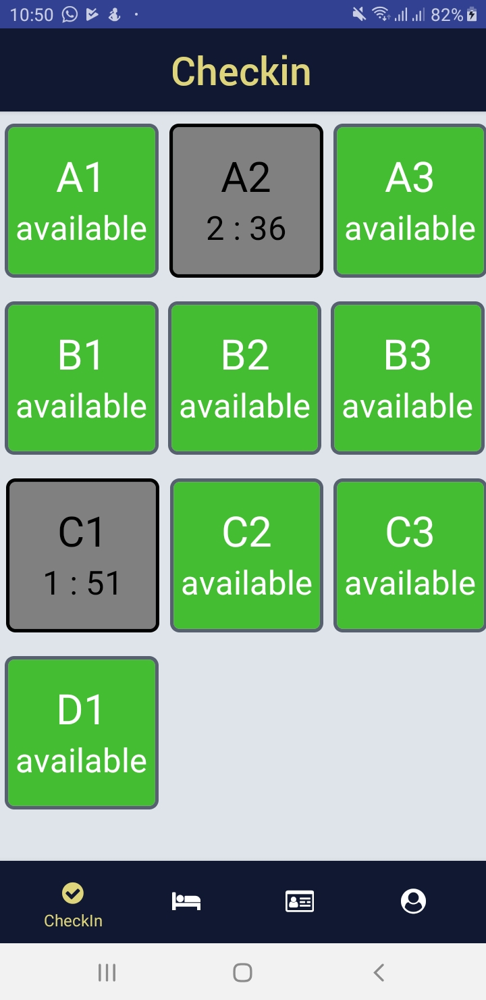

<h1 align="center">
  <br>
</h1>

## Royal Hotel Apps
This project is still on very early development stage. If you want to use for production, use it with your own risk.
<br>More feature Coming Really Soon.

## Introduction Royal
- Royal hotel is a more appropriate application used for users or receptionists to facilitate it in managing hotel rooms in real time, and recognizing customer identity

## Screenshots

<p float="left">
  

  
  
  

  

  
  
  

  
  
  
   
  
</p>


## Features
* Room monitoring in real time
* Recognize customer identity
* Automatic checkin and checkout

## Why Royal Hotel?
* Out of the box app of the year!
* It's React Native, so it support android & iOS by default!
* Simple Code, so you can easily contribute on it.
* Meteor is one of the most starred javascript framework, and it is very easy to use

## Tech Stack
* React Native for the Mobile Frontend
* Native Base UI Component
* React Native Navigation
* React Native Slider Show
* React Native Image Picker
* Express Js
* Sequelize ORM
* Redux
* Firebase
* Heroku

## Prerequisites
* Make sure You had been install NodeJs in your system https://nodejs.org/
* Then install React Native https://facebook.github.io/react-native/
* Then install React Native https://docs.nativebase.io/
* Then install React Native Navigation https://facebook.github.io/react-native/docs/0.60/navigation
* Then install Sequelize ORM https://sequelize.org/
* Then install React Native https://redux.js.org/
* Then install image-picker https://github.com/react-native-community/react-native-image-picker/blob/master/docs/Install.md
* Then install image-slider-show https://www.npmjs.com/package/react-native-image-slider-show
* Don’t forget Node Js as the backend https://nodejs.org/en/

## Installation & Configuration
Follow these step to install

**Frontend:**
```
$ git clone https://github.com/noorqidam/arttoon/tree/master
$ cd course-repo-example/frontend
$ npm install
$ react-native run-ios #for ios
$ react-native run-android #for android
```
Open “app/Config.js”, and set the meteorUri variable as your Meteor server run at
```javascript
export const meteorUri = ‘ws://localhost:3000/websocket’;
```

**Back-end:**
```
$ cd course-repo-example/backend
$ express npm install
$ express #run your express on http://localhost:3000
```

## Support Me :)
* Star this repository :star:
* Hire Me https://www.linkedin.com/in/noorqidam

## Contact 
* WA/TELEGRAM: +62 8577 1603 597
* email: noorqidam@gmail.id
